# MCP Interactive Demo

An interactive Node.js application that demonstrates the Model Context Protocol (MCP) with Google GenAI integration. The application intelligently decides when to use MCP tools based on user input and provides an interactive chat experience.

## 📁 Project Structure

```
mcp-demo/
├── 📄 README.md             # This file
├── 📦 package.json          # Dependencies & scripts
├── ⚙️ tsconfig.json         # TypeScript configuration
├── 🔒 .env                  # Environment variables (create this)
├── 📋 config.example.json   # Example configuration
├── 🚫 .gitignore            # Git ignore rules
└── 📂 src/
    ├── 🎯 index.ts          # Main application entry point
    ├── 🔧 client.ts         # MCP client implementation
    └── ⚙️ config.ts         # Configuration management
```

### Architecture Overview

```mermaid
graph TB
    User[👤 User] --> CLI[🖥️ Interactive CLI]
    CLI --> Demo[🤖 InteractiveMCPDemo]
    Demo --> Gemini[🧠 Google Gemini AI]
    Demo --> MCP[🔧 StreamableMCPClient]
    MCP --> AWS[☁️ AWS Knowledge MCP Server]
    
    Config[⚙️ Configuration] --> Demo
    Config --> MCP
    
    subgraph "Decision Flow"
        Gemini --> Decision{Should use MCP?}
        Decision -->|Yes| ToolCall[Call MCP Tool]
        Decision -->|No| DirectResponse[Direct AI Response]
    end
    
    ToolCall --> AWS
    AWS --> Stream[📡 Streaming Response]
    Stream --> Summary[📋 AI Summary]
```



### Application Flow


### Common Issues


## 🚀 Quick Start

### Prerequisites
- Node.js 18+ 
- npm or yarn
- Google API key for Gemini

### Installation

1. **Clone and install**:
   ```bash
   git clone https://github.com/pierrehanne/mcp-demo.git
   cd mcp-demo
   npm install
   ```

2. **Environment setup**:
   ```bash
   # Create .env file
   echo "GOOGLE_API_KEY=your_google_api_key_here" > .env
   echo "GEMINI_MODEL=gemini-2.5-flash-lite" >> .env
   ```

3. **Optional configuration**:
   ```bash
   # Customize MCP servers and settings
   cp config.example.json config.json
   # Edit config.json as needed
   ```

4. **Run the application**:
   ```bash
   npm start
   # or for development with auto-reload
   npm run dev
   ```

### Usage Guide

| Command | Description | Example |
|---------|-------------|---------|
| `help` | Show available commands | `help` |
| `tools` | List MCP tools | `tools` |
| `quit` | Exit application | `quit` or `exit` |

## 📚 Learn More

### Related Technologies
- [Model Context Protocol (MCP)](https://modelcontextprotocol.io/) - Protocol specification
- [Google Gemini AI](https://ai.google.dev/) - AI model documentation
- [AWS MCP Servers](https://github.com/aws-samples/mcp-server-examples) - Example implementations
